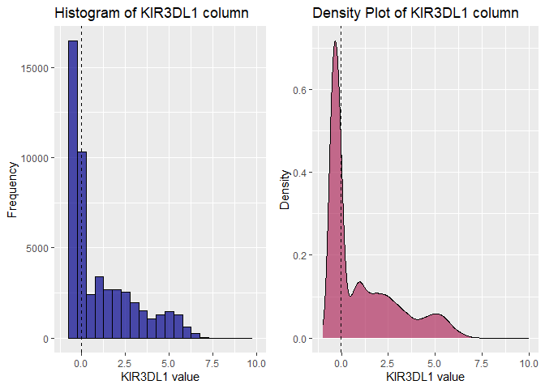
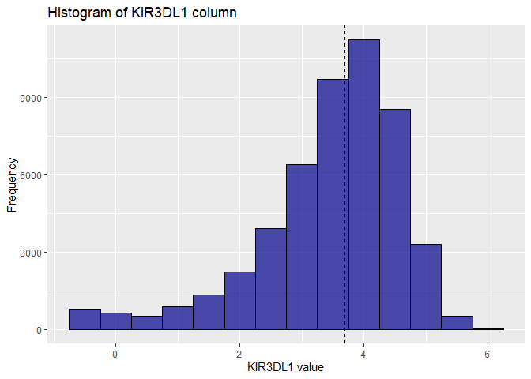

EDA_FA1_KHAFAJI
================
Mostafa Khafaji
2025-02-02

## Data

We will be using the CYTOF_ONE_EXPERIMENT dataset, which we will load
using the following:

``` r
data_cytof <- read.csv("cytof_one_experiment.csv")
head(data_cytof)
```

    ##        NKp30    KIR3DL1      NKp44    KIR2DL1 GranzymeB       CXCR6      CD161
    ## 1  0.1875955  3.6156932 -0.5605694 -0.2936654  2.477893 -0.14470053 -0.3152872
    ## 2  1.0348518  1.7001820 -0.2889611 -0.4798280  3.261016 -0.03392447 -0.4112129
    ## 3  2.9996398  6.1411419  1.9032606  0.4823102  4.277562  1.94654156 -0.5022347
    ## 4  4.2998594 -0.2211586  0.2425707 -0.4831267  3.351808  0.92622195  3.8772370
    ## 5 -0.4386448 -0.5035892 -0.1526320  0.7506128  3.194145 -0.05893640  1.0907379
    ## 6  2.0883050 -0.3992646  3.4550676 -0.5200856  4.345102 -0.36434277 -0.5705891
    ##       KIR2DS4     NKp46      NKG2D      NKG2C       X2B4     CD69 KIR3DL1.S1
    ## 1  1.94497046 4.0818316  2.6200784 -0.3573817 -0.2711557 3.849965 -0.2554637
    ## 2  3.80251714 3.7339299 -0.4832788 -0.4675984 -0.5594752 2.910197 -0.2909482
    ## 3 -0.32010171 4.5594631 -0.5069090  2.6193782 -0.4554785 3.113454  3.6613886
    ## 4 -0.16969487 4.4831486  1.9272290 -0.3110146  1.6350771 3.045998  0.2871241
    ## 5 -0.05033025 0.8379358 -0.4581674  0.9216947  1.2419054 2.644422  0.4218294
    ## 6 -0.45033591 4.0550848  3.4283565  0.6272837 -0.4157104 3.958158  0.7993406
    ##          CD2    KIR2DL5    DNAM.1         CD4        CD8       CD57      TRAIL
    ## 1  5.3529769 -0.5092906 0.8811347 -0.32347280 -0.2822405  3.3254704 -0.6084228
    ## 2  4.3132510  3.7774776 1.5406568 -0.13208167  0.9161920  2.4946442 -0.5034739
    ## 3  5.5969513  0.8128166 1.0005903 -0.59933641  1.8382744  3.9897914 -0.2749380
    ## 4 -0.5002885  0.3612212 1.2663267 -0.12568567  0.7667204  1.9950916 -0.5130930
    ## 5 -0.5479527  1.0638327 0.8722272 -0.07107408 -0.1059012  3.4291302 -0.1433044
    ## 6  5.1028564  3.0918867 0.8717267 -0.47986180 -0.2577198 -0.5784575 -0.5731323
    ##       KIR3DL2      MIP1b     CD107a      GM.CSF       CD16        TNFa
    ## 1 -0.30668543  1.2497120 -0.1295305 -0.43074102  3.9951417  0.90143498
    ## 2 -0.54320954  2.8693060 -0.1887180 -0.16283845  4.4082309  1.93590153
    ## 3  2.06488239  4.0955112 -0.1998480  3.18853825  6.0023244 -0.02336999
    ## 4  2.11247859  3.3726018 -0.5720339  0.91310694  5.8238698 -0.60793749
    ## 5 -0.02505141 -0.3099826 -0.1068511 -0.60370379  4.0122501 -0.61989100
    ## 6 -0.28337673 -0.4108283 -0.1797545 -0.06372458 -0.5832926  0.14311030
    ##           ILT2 Perforin KIR2DL2.L3.S2      KIR2DL3      NKG2A    NTB.A     CD56
    ## 1 -0.386027758 6.431983    1.22710292  2.660657999 -0.5220613 4.348923 2.897523
    ## 2  2.983874845 6.814827   -0.04141081  3.841304627  4.6771149 3.474335 3.782870
    ## 3 -0.521099944 5.099562   -0.16705075 -0.009694396 -0.4730573 5.634341 5.701186
    ## 4 -0.043783559 5.841797   -0.51753289 -0.592990887 -0.4059049 4.598021 6.065672
    ## 5  1.182703288 4.888777   -0.36251589 -0.398123704 -0.5440881 3.606101 1.966169
    ## 6 -0.003258955 3.952542   -0.20194392 -0.202592720  3.8882776 2.346275 6.473243
    ##         INFg
    ## 1 -0.3841108
    ## 2  2.7186296
    ## 3  2.5321763
    ## 4  2.4564582
    ## 5  3.1470092
    ## 6  2.8282987

------------------------------------------------------------------------

## Looking at KIR3DL1 Data Column

Let’s look at the KIR3DL1 Column using a histogram, and a density
estimation plot

``` r
# Create histogram on KIR3DL1 column
Hist_plot <- ggplot(data_cytof, aes(x=KIR3DL1)) + 
  geom_histogram(alpha=0.7, binwidth = 0.5, color = "black", fill="darkblue")+
  geom_vline( aes(xintercept = median(KIR3DL1, na.rm = TRUE)), color = "black", linetype="dashed") +
  
  # create labels
  ggtitle("Histogram of KIR3DL1 column") +
  ylab("Frequency") +
  xlab("KIR3DL1 value")+

  # show negative numbers for better visualization
  scale_x_continuous( limits = c(-1, 10) )
  

dens_plot <- ggplot(data_cytof, aes(x=KIR3DL1)) + 
  geom_density(alpha=0.7, color = "black", fill="maroon")+
  geom_vline( aes(xintercept = median(KIR3DL1, na.rm = TRUE)), color = "black", linetype="dashed") +
  
  # create labels
  ggtitle("Density Plot of KIR3DL1 column") +
  ylab("Density") +
  xlab("KIR3DL1 value")+
  
  # show negative numbers for better visualization
  scale_x_continuous( limits = c(-1, 10) )

grid.arrange(Hist_plot, dens_plot, ncol = 2)
```

    ## Warning: Removed 2 rows containing missing values or values outside the scale range
    ## (`geom_bar()`).

<!-- -->

The histogram and the density plot of KIR3DL1 shows us that most of the
values are negative. The data is then heavily skewed to the right, in
this case indicating that most values of the KIR3DL1 are close to zero.
The distribution is also leptokurtic, or has a positive kurtosis,
showing that, as the median line have shown and as said earlier, that
most of the numbers are negative, and are close to zero ($x>-1$).

------------------------------------------------------------------------

## Looking at KIR3DL1 and GranzymeB Data

``` r
ggplot(data_cytof, aes(x=GranzymeB)) + 
  geom_histogram(alpha=0.7, binwidth = 0.5, color = "black", fill="darkblue")+
  geom_vline( aes(xintercept = median(GranzymeB, na.rm = TRUE)), color = "black", linetype="dashed") +
  
  # create labels
  ggtitle("Histogram of KIR3DL1 column") +
  ylab("Frequency") +
  xlab("KIR3DL1 value")
```

<!-- -->

``` r
qq_df <- as.data.frame(qqplot(data_cytof$KIR3DL1, data_cytof$GranzymeB, plot.it = FALSE))

ggplot(qq_df, aes(x = x, y=y)) +
  geom_point()+
  xlab("KIR3DL1")+ylab("GranzymeB")+
  geom_abline(slope = 1, intercept = min(qq_df$x), color="red", linetype="dashed")
```

<!-- -->

The Q-Q plot shows us that the distribution of GranzymeB is skewed to
the left, compared to the distribution of KIR3DL1. The vice-versa is
also applicable, as we have seen previously: that KIR3DL1 is much more
skewed to the right compared to the distribution of GranzymeB. This is
shown by the curve at the right end of the graph, where the q-q plot is
above the reference line, showing what has been said earlier. At the
left part of the graph, we can see that the q-q plot is below the
reference line, showing, again, that the distribution of GranzymeB is,
again, skewed more to the left when compared to that of KIR3DL1.
